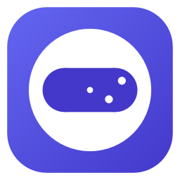
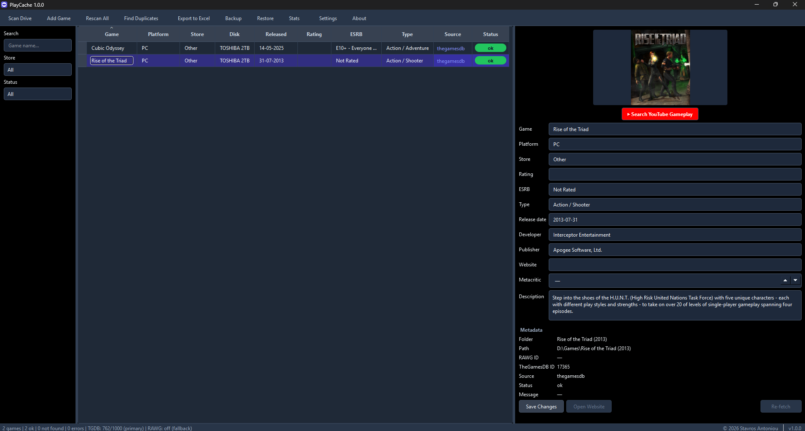

<p align="center">
  
</p>

<h1 align="center">PlayCache</h1>

<p align="center">
A desktop catalog for every game you own. Point PlayCache at your game folders
and it fetches covers, ratings, and descriptions from <strong>RAWG</strong>
(primary) and <strong>TheGamesDB</strong> (fallback + merge), then presents them in a
polished <strong>dark-themed</strong> view you can search, edit, and export to Excel.
Backed by a local <strong>SQLite</strong> database with compressed JSON backups and
a statistics dashboard. Runs on <strong>Windows</strong> and <strong>Linux</strong>.
</p>

<p align="center">
  <a href="https://github.com/stavros-it/PlayCache/actions"></a>
  
  
  
  
  
</p>

<p align="center">
  
</p>

---

## Features

### Cataloguing
- **Smart folder-name detection** — a 6-priority chain resolves the real game
  name from messy folder names:
  1. Steam `appmanifest_*.acf` manifest (matched by `installdir`)
  2. GOG `goggame-*.info` JSON metadata (prefers base game over DLC)
  3. GOG setup executable filename
     (`setup_achilles_legends_untold_1.4.0.0_(74603).exe` → `Achilles Legends Untold`)
  4. Cleaned folder name (strips `[SteamRip]`, `v1.2`, `-CODEX`, `RePack by FitGirl`)
  5. Largest non-launcher `.exe` (CamelCase split, architecture suffix strip)
  6. Cleaned folder name (final fallback)
- **Store detection** from path (Steam / GOG / Epic / Other)
- **Disk conflict detection** — pauses and prompts the user when a game exists
  on a different disk (new / old / both)
- **Symlink/junction cycle protection** — won't infinite-loop on NTFS junctions
- **Steam manifest caching** — O(N) instead of O(N²) per scan

### Metadata sources
- **RAWG (primary)** — free, requires a key. Provides genres, developers,
  publishers, release date, Metacritic score, numeric user rating, cover
  image, website, and description. 20,000 requests/month.
- **TheGamesDB (fallback + merge)** — free, optional but recommended. When
  RAWG has no match, TGDB is queried. When RAWG succeeds, TGDB is *also*
  queried in a merge step to fill ESRB age ratings (which RAWG lacks).
  If TGDB is unreachable, the merge step is skipped silently.
- **Fuzzy matching** with `difflib.SequenceMatcher` (configurable threshold)
- **Retry/backoff** with `Retry-After` honoring on 429; 4xx errors are not retried

### GUI
- **Dark slate theme** — centralized palette in `playcache/gui/theme.py` for
  eye-friendly contrast. Subtle zebra striping; indigo selection state.
- **Smart row coloring** — the Status column renders as a colored badge
  (green=ok, amber=not_found, red=error, blue=pending) with text color chosen
  by WCAG luminance so it's always readable.
- **Sortable/filterable table** — auto-fit columns (Excel-like), case-insensitive
  alphabetical sort by default, custom sort keys for date and rating columns
- **Detail panel** — cover image, all metadata, YouTube gameplay search,
  inline-editable fields
- **Multi-row selection** with bulk re-fetch and bulk delete
- **Stats dialog** — metric cards (totals + completeness) and bar charts
  (by status, source, platform, store, ESRB, disk, release year). The "By disk"
  chart shows volume labels (e.g. "TOSHIBA 2TB") not drive letters.
- **Find Duplicates…** (Ctrl+D) — fuzzy name matching (char similarity + token
  Jaccard + substring + Roman numerals), suggests which copies to remove
- **About dialog** with app info and copyright notice

### Persistence
- **SQLite storage** with a `v_excel` view mirroring the 6-column reference layout
- **Manual overrides** — user edits persist across rescans (JSON map per row)
- **Manual game adding** — "Add Game…" (Ctrl+N) for games not currently installed
- **Backup/Restore** — compressed JSON (`.json.gz`) catalog snapshots with a
  versioned envelope. Merge (upsert by `folder_path`) or replace-all mode.
  Forward/backward compatible (unknown columns ignored, missing columns get
  defaults).
- **Excel export** with auto-filter

## Quick start

### Option A: Download a release (no Python required)

1. Go to [Releases](https://github.com/stavros-it/PlayCache/releases)
2. Download the latest:
   - **Windows**: `PlayCache-vX.Y.Z-windows-portable.zip` — extract and run `PlayCache.exe`
   - **Linux**: `PlayCache-vX.Y.Z-linux-x86_64.AppImage` — `chmod +x` and run
3. On first launch, `config.ini` is auto-created from the bundled example.
   Edit it and paste your free RAWG API key.

### Option B: Run from source

**Windows (PowerShell):**
```powershell
# 1. Install dependencies
python -m pip install -r requirements.txt

# 2. Copy the config template and add your free RAWG key
Copy-Item config.example.ini config.ini
notepad config.ini        # paste your key under [thegamesdb] api_key =

# 3. Launch the GUI (opens maximized, sorted alphabetically)
python run.pyw            # no console window; logs to playcache.log
# or
python run.py             # console visible (useful for debugging)
```

**Linux (bash):**
```bash
# 1. Install dependencies
python3 -m pip install -r requirements.txt

# 2. Copy the config template and add your free RAWG key
cp config.example.ini config.ini
${EDITOR:-nano} config.ini   # paste your key under [thegamesdb] api_key =

# 3. Launch the GUI (opens maximized, sorted alphabetically)
python3 run.pyw               # logs to playcache.log
# or
python3 run.py                # console visible (useful for debugging)
```

The GUI opens with three panels: filters on the left, the games table in the
centre, and a detail panel on the right. Use the toolbar to scan a drive,
rescan, export to Excel, back up the catalog, view stats, or change settings.

## Get free API keys

| Provider | Sign-up URL | Notes |
|----------|-------------|-------|
| **RAWG** (recommended) | https://rawg.io/ | Primary source. 20,000 requests/month. Requires a free account to get an API key. |
| **TheGamesDB** (optional) | https://thegamesdb.net/ | Fallback + merge. 1000 requests/month. Requires a free account to get an API key. |

Put the keys in `config.ini`, or set environment variables `THEGAMESDB_API_KEY`
and `RAWG_API_KEY` (or `PLAYCACHE_THEGAMESDB_API_KEY` /
`PLAYCACHE_RAWG_API_KEY` for any config value). Without any key the app still
scans and records folder names (marked `not_found`) so you can fill metadata
later. You can also set keys from the GUI via **Settings…**.

## Using the GUI

| Action | How |
|--------|-----|
| **Scan a drive** | Toolbar → **Scan Drive…** → pick a drive/folder, set options, **Start Scan** |
| **Add a game manually** | Toolbar → **Add Game…** (Ctrl+N) — no folder required |
| **Filter the table** | Type in the **Search** box, pick a **Store** or **Status** from the dropdowns |
| **View a game's details** | Click a row → cover image, metadata, and editable fields appear on the right |
| **Edit a field** | Change a value in the detail panel → **Save Changes** (persists as a manual override) |
| **Re-fetch a game** | Right-click a row → **Re-fetch metadata**, or use the button in the detail panel |
| **Rescan everything** | Toolbar → **Rescan All** (manual overrides are preserved) |
| **Find duplicates** | Toolbar → **Find Duplicates…** (Ctrl+D) — fuzzy-matches similar games |
| **Export to Excel** | Toolbar → **Export to Excel…** (Ctrl+E) → choose a `.xlsx` path |
| **Back up catalog** | Toolbar → **Backup…** (Ctrl+B) → compressed `.json.gz` snapshot |
| **Restore catalog** | Toolbar → **Restore…** (Ctrl+I) → merge or replace-all |
| **View statistics** | Toolbar → **Stats** → metric cards + bar charts |
| **Open game folder** | Right-click a row → **Open folder in Explorer** (hidden for manual games) |
| **Delete a game** | Right-click a row → **Delete from catalog…** (folder on disk is untouched) |
| **Change settings** | Toolbar → **Settings…** → API keys, delays, fuzzy threshold, etc. |

Scans run in a background thread with live progress, so the UI stays
responsive. Cover images are downloaded lazily and cached on disk under
`<db_dir>/covers/`.

## How matching works

For each folder, the cleaned name is sent to RAWG's search endpoint.
The top results are scored with a fuzzy similarity ratio (stdlib `difflib`);
the best match above the configured threshold (`fuzzy_threshold`, default 60)
is fetched in full. If RAWG returns no confident match, the same flow runs
against TheGamesDB. When RAWG succeeds, TGDB is *also* queried in a merge
step to fill the `esrb_rating` that RAWG lacks — only empty fields are
filled, RAWG data is never overwritten.
Re-runs skip games already marked `ok` unless **Rescan All** (or **Re-fetch**
on a single row) is used, so you can resume large scans.

## Manual overrides

When you edit a field in the detail panel, the new value is stored both in the
column and in a `manual_overrides` JSON map (`{"user_rating": "10/10"}`). On
the next rescan, the cataloger re-applies these overrides after fetching fresh
API data, so your edits are never silently overwritten. To let the API fill a
field again, delete the override by re-fetching or editing the field back to
the API value (use the DB API directly if you need finer control — see
`db.clear_override`).

## Database schema

Table `games` stores the 6 catalogue columns plus metadata for re-fetching and
auditing (`rawg_id`, `thegamesdb_id`, `release_date`, `developer`,
`publisher`, `metacritic_score`, `cover_url`, `esrb_rating`, `data_source`,
`fetch_status`, `fetch_message`, `manual_overrides`, timestamps). The view
`v_excel` reproduces the Excel layout exactly and is what **Export to Excel**
reads. Inspect with any SQLite tool:

```powershell
python -c "import sqlite3; c=sqlite3.connect('game_library.db'); [print(r) for r in c.execute('SELECT \"GAME NAME\",\"GOG / STEAM\",\"USER RATING\" FROM v_excel LIMIT 10')]"
```

## Backup format

Backups use a gzip-compressed JSON envelope (`.json.gz`):

```json
{
  "format_version": 1,
  "app_version": "1.0.0",
  "exported_at": "2026-08-16T12:34:56+00:00",
  "count": 135,
  "games": [ { "folder_path": "...", "game_name": "...", ... }, ... ]
}
```

The format is versioned for forward/backward compatibility — a backup from an
older version imports cleanly into a newer one (missing columns get dataclass
defaults), and a backup with unknown columns is tolerated (extra keys are
ignored). Backups newer than the running app's `FORMAT_VERSION` are rejected
with a clear "upgrade PlayCache" message.

## Project layout

```
playcache/
  __init__.py             # version = "1.0.0"
  config.py               # loads config.ini / env vars (PLAYCACHE_*)
  models.py               # GameRecord dataclass + computed disk/release props
  db.py                   # SQLite schema, upsert, v_excel view, overrides, stats
  folder_scanner.py       # drive parsing, smart name detection, store/platform
  textutils.py            # HTML strip, truncation, rating format, fuzzy match
  rawg_client.py          # RAWG API client — primary source
  thegamesdb_client.py    # TheGamesDB fallback client; genres/devs/pubs/boxart/quota
  cataloger.py            # scan → fetch → merge → upsert orchestrator
  image_cache.py          # async Qt cover-image fetcher with disk cache
  exporter.py             # SQLite → .xlsx (6-column reference layout)
  backup.py               # compressed JSON backup/restore (.json.gz)
  assets/                 # app.ico (multi-resolution) + app.png
  gui/                    # PySide6 GUI package
    theme.py              # centralized dark palette + DARK_QSS + contrast_text()
    item_delegate.py      # GamesItemDelegate — status badges + source accents
    table_model.py        # QAbstractTableModel (fieldEdited signal)
    main_window.py        # toolbar, filters, table, proxy, status bar
    scan_dialog.py        # scan config + ScanWorker QThread + conflict prompt
    detail_panel.py       # cover + YouTube search + metadata + edits
    settings_dialog.py    # API keys / scan params editor (atomic write)
    stats_dialog.py       # polished stats overview: cards + bar charts
    about_dialog.py       # About dialog: app icon, version, copyright
    duplicates_dialog.py  # fuzzy duplicate finder + resolver
run.pyw                   # GUI entry point (no console, maximized)
run.py                    # Console entry point (same app, maximized)
tests/                    # pytest suite (164 tests)
```

## Testing

```powershell
python -m pytest tests/ -q
```

The tests use mocked API responses (no network) and cover: name cleaning,
smart game-name detection, store/platform detection, recursive container
descent, DB upserts, TheGamesDB + RAWG response parsing, the merge step,
the rescan/skip logic, manual override persistence, schema migration, the
Excel round-trip, and compressed JSON backup/restore (round-trip, merge,
replace-all, bad envelopes, corrupt gzip, legacy/missing columns).

## Linting

```powershell
ruff check playcache/ tests/ run.py run.pyw scripts/
```

## Troubleshooting

- **`TheGamesDB API key is not set`** — edit `config.ini` `[thegamesdb] api_key`
  or set `THEGAMESDB_API_KEY`, or use **Settings…** in the GUI. Games are still
  recorded with `fetch_status=not_found`.
- **Games marked `not_found`** — the folder name may not match the API title.
  Try **Re-fetch** on that row after renaming, or lower `fuzzy_threshold` in
  **Settings…**.
- **Slow scans** — `request_delay` (default 0.3s) paces the free APIs. Raise
  it if you hit `429 Too Many Requests`. Scans run in the background so the UI
  stays responsive.
- **Wrong store label** — store is guessed from the path; a top-level folder
  with no library context is labelled `Other`. Point the scanner at the library
  root (`D:\SteamLibrary\steamapps\common`) for accurate labels.
- **Edited field keeps reverting** — you may have a stale manual override.
  Re-fetch the game to let the API fill it again, or clear the override via
  `db.clear_override`.
- **Cover images not loading** — check your network connection; images are
  fetched from TheGamesDB's CDN (with RAWG as fallback) and cached under
  `<db_dir>/covers/`.
- **RAWG returns 522** — RAWG's API is occasionally unavailable. The app
  silently skips the merge step; everything else still works. A rescan will
  pick up the missing fields when RAWG recovers.

---

## Development

PlayCache was developed by **Stavros Antoniou** with the assistance of AI
tools. Code, tests, documentation, and design decisions were produced in
collaboration with AI assistants (Claude and GLM-5.2 via the OpenCode CLI).
All AI-generated output was reviewed and curated by the author. The project
is the intellectual property of the author.

---

## License

Copyright (c) 2026 **Stavros Antoniou**. All rights reserved.

PlayCache is provided as-is for personal use. The software is the
intellectual property of the author. Third-party APIs (TheGamesDB, RAWG)
are subject to their respective terms of service and usage quotas.
